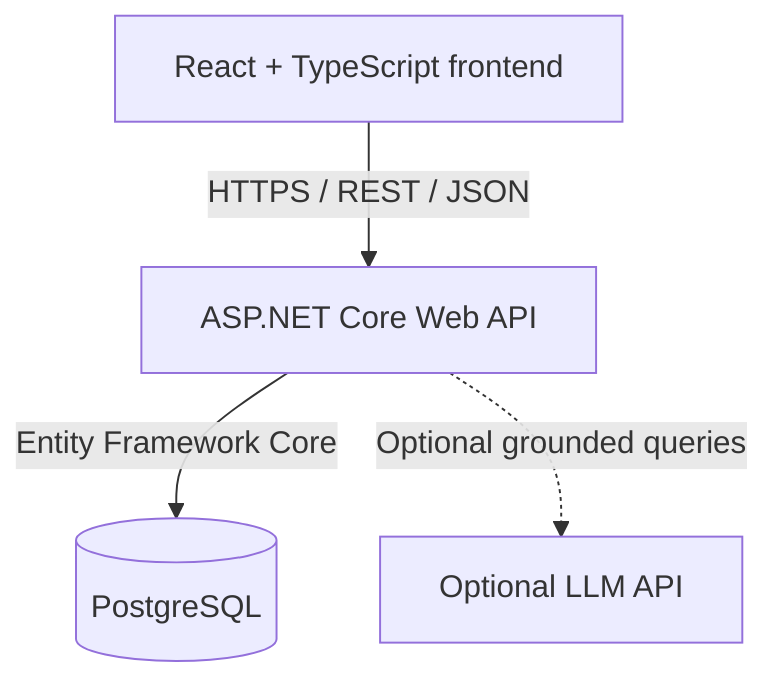

# InventoryFlow

Portfolio full-stack inventory management web application for a small or medium-sized business.

InventoryFlow is designed to demonstrate production-style software engineering across REST API design, relational data modeling, responsive UI development, testing, deployment, and AI-assisted development practices.

**Current status:** Planning. The repository has been initialized; application features have not been implemented yet.

---

## Project Overview

InventoryFlow will simulate a realistic inventory system: products, categories, suppliers, stock movements, purchase orders, and operational visibility on a dashboard.

The application is a portfolio project, not a production SaaS product. The goal is to show how a full-stack system can be designed, built, tested, and deployed with clear business rules around inventory accuracy.

Nothing described below should be treated as currently available functionality unless it is listed as complete in [Project Status](#project-status).

---

## Project Goals

- Demonstrate end-to-end full-stack development with a React frontend and an ASP.NET Core Web API.
- Model inventory as a relational domain with explicit transaction history, not as a quantity field that is edited in isolation.
- Practice REST API design, Entity Framework Core, and PostgreSQL data modeling.
- Build a responsive UI that remains usable on desktop, tablet, and mobile.
- Deploy a public demo using Docker and Render.
- Apply testing and CI/CD as later milestones.
- Explore optional LLM assistance that explains inventory conditions without becoming the source of truth for stock.

---

## Planned Features

**Completed features:** none. Implementation has not started.

### Dashboard

- Total products
- Total inventory value
- Low-stock products
- Open purchase orders
- Recent inventory activity

### Product Management

- Create, view, edit, and deactivate products
- Search, filtering, and sorting
- Product fields: SKU, name, category, supplier, unit price, quantity in stock, reorder level, active status
- Deactivation is used instead of hard deletion so historical purchase-order and inventory-transaction relationships are preserved

### Categories

- Create and manage product categories

### Suppliers

- Create and manage suppliers
- Store supplier contact information

### Inventory Management

- Receive stock
- Remove stock
- Manual inventory adjustments
- Record inventory transaction history with reason and timestamp
- Prevent quantity changes that are not backed by a corresponding transaction

### Low-Stock Monitoring

- Identify products where quantity in stock is at or below reorder level
- Surface warnings on the dashboard and product pages

### Purchase Orders

- Create purchase orders with multiple products
- Track statuses such as Draft, Submitted, Ordered, and Received
- Receiving an order updates inventory and writes inventory transaction records
- Receiving is transactional and protected against processing the same order twice

### Responsive UI

- Desktop, tablet, and mobile layouts
- Tables that adapt for small screens

### Authentication / Authorization

Later milestone. Planned roles include Admin and Viewer, plus safe public demo access.

### Testing

- Unit tests for important business logic
- API/integration tests where appropriate

### Deployment

- Dockerized ASP.NET Core API
- Public API and frontend deployment on Render
- Hosted PostgreSQL database

### CI/CD

Later milestone. Planned GitHub Actions workflows for build, automated tests, and deployment.

### Optional AI Inventory Assistant

- Answer questions using actual inventory data
- Summarize low-stock conditions and inventory trends
- Help identify items that need attention
- LLM output is grounded in application/database data
- The LLM does not modify authoritative inventory data

---

## Technology Stack

All items below are **planned**. The project has not been scaffolded yet.

| Area | Planned technologies |
| --- | --- |
| Frontend | React, TypeScript, Vite, responsive/mobile-friendly UI |
| Backend | ASP.NET Core Web API (.NET 8), C#, Entity Framework Core, REST APIs |
| Database | PostgreSQL |
| Development | Git, GitHub |
| Deployment | Docker, Render |
| CI/CD | GitHub Actions (later) |
| Optional AI | LLM API integration through the backend |

---

## Architecture

Planned high-level flow. Optional LLM integration is not required for core inventory operations.



The frontend will call REST endpoints on the ASP.NET Core API. The API will own business rules and persist state through Entity Framework Core to PostgreSQL. If an inventory assistant is added later, the API will gather current inventory data and send that context to an LLM. Inventory calculations and modifications remain in application business logic and the database.

---

## Planned Database Model

Exact columns, constraints, and indexes will be defined during implementation. The intended domain is:

| Entity | Role |
| --- | --- |
| **Product** | Catalog item with SKU, name, category, one supplier, unit price, current quantity in stock, reorder level, and active status. Products are deactivated rather than hard-deleted. |
| **Category** | Product grouping |
| **Supplier** | Vendor record and contact information |
| **InventoryTransaction** | History of stock receipts, removals, and adjustments, including reason and timestamp |
| **PurchaseOrder** | Header for an order to a supplier, including status |
| **PurchaseOrderItem** | Line items on a purchase order |
| **User** | Authentication identity; later milestone |

Intended relationships:

- A product belongs to a category and has one supplier.
- Inventory transactions reference a product.
- A purchase order has many purchase order items.
- Purchase order items reference products.
- Deactivating a product preserves those historical purchase-order and inventory-transaction relationships.
- Users are deferred until the authentication milestone.

---

## Business Rules

These rules are part of the product design and will be enforced in the API, not only in the UI.

**Current quantity is stored on the product.** `Product.QuantityInStock` represents the current inventory quantity and is stored on the product for efficient access. `InventoryTransaction` is the audit and history record of every inventory change.

**QuantityInStock must never be changed independently.** Receiving stock, removing stock, and manual adjustments must each create a corresponding `InventoryTransaction` with a reason and timestamp. Application business logic is responsible for updating `QuantityInStock` and creating the `InventoryTransaction` together.

**Purchase-order receiving is atomic.** Receiving an order must update product quantities, create the corresponding inventory transactions, and change the purchase-order status in one unit of work. If any part of receiving fails, inventory and order status should remain consistent.

**Receiving is idempotent at the order level.** Processing the same purchase order twice must not double-count stock. Once an order has been received, a second receive attempt should be rejected.

**Products are deactivated, not hard-deleted.** Products may be referenced by purchase orders and inventory transactions. Deactivation preserves those historical relationships.

**Low stock is derived from stored data.** A product is low-stock when `QuantityInStock` is at or below its reorder level.

**The LLM is advisory only.** An optional assistant may summarize conditions and highlight items that need attention. It must not calculate authoritative quantities or modify inventory, products, or purchase orders. Application business logic and PostgreSQL remain the source of truth.

---

## API Design

The API surface is **planned** and may change during implementation. The examples below illustrate intended resources, not a frozen contract.

```
GET    /api/products
GET    /api/products/{id}
POST   /api/products
PUT    /api/products/{id}

GET    /api/categories
POST   /api/categories

GET    /api/suppliers
POST   /api/suppliers

GET    /api/inventory/transactions
POST   /api/inventory/receive
POST   /api/inventory/remove
POST   /api/inventory/adjust

GET    /api/purchase-orders
POST   /api/purchase-orders
POST   /api/purchase-orders/{id}/receive

GET    /api/dashboard
```

Purchase order status changes (Draft, Submitted, Ordered, Received) will be modeled as explicit API operations rather than unconstrained field edits. Product activation and deactivation will also be modeled as an explicit operation rather than a hard delete; the exact route has not been decided. Request and response payloads will be defined when the backend is implemented.

---

## Responsive Design

The UI is planned to work across desktop, tablet, and mobile viewports. Data-heavy screens such as product lists, transaction history, and purchase orders should remain usable on small screens, with tables adapting rather than overflowing horizontally.

---

## Development Roadmap

Progress will be tracked here as work is completed.

- [ ] **Phase 1** — Project setup and backend foundation
- [ ] **Phase 2** — Products, categories, and suppliers
- [ ] **Phase 3** — Inventory transactions
- [ ] **Phase 4** — Purchase orders
- [ ] **Phase 5** — Dashboard, search, filtering, and reporting
- [ ] **Phase 6** — Responsive frontend polish
- [ ] **Phase 7** — Authentication and authorization
- [ ] **Phase 8** — Docker and Render deployment
- [ ] **Phase 9** — Automated testing and GitHub Actions CI/CD
- [ ] **Phase 10** — Optional AI inventory assistant

---

## Local Development

TBD. Local setup instructions will be added after the project is scaffolded (React + Vite frontend, ASP.NET Core API, and PostgreSQL).

Until then, there is no runnable application in this repository.

---

## Deployment

**Planned.** No public deployment exists yet.

Intended target:

- Dockerized ASP.NET Core API
- Hosted PostgreSQL
- React frontend deployed publicly
- Hosting on Render

Deployment details (environment variables, service URLs, and runbooks) will be documented when the first environment is created.

---

## Testing Strategy

Testing is a planned later milestone, not a current capability.

- Unit tests for important business logic, especially inventory quantity updates, transaction recording, and purchase-order receiving
- API/integration tests where they add confidence around persistence and transactional behavior
- GitHub Actions to run the test suite as part of CI/CD (Phase 9)

---

## Future Improvements

Items not in the initial implementation path, or deferred to later phases:

- Admin and Viewer roles, plus a safe public demo mode
- GitHub Actions for build, test, and deployment
- Optional LLM inventory assistant grounded in live application data
- Multiple suppliers per product in a future version, potentially including supplier-specific pricing or supplier product information
- Additional reporting, notifications, or operational tooling after the core inventory loop is stable

---

## Project Status

| Area | Status |
| --- | --- |
| Repository | Initialized |
| Application code | Not started |
| Database | Not created |
| Local development | TBD |
| Tests | Not started |
| Deployment | Planned |
| CI/CD | Later milestone |
| AI assistant | Optional later milestone |

This README describes intended design. It is not a statement of current product capability.

---

## Author

**Yuheng Zhou (Henry)**

- GitHub: [HenryZhou42](https://github.com/HenryZhou42)
- Repository: [InventoryFlow](https://github.com/HenryZhou42/InventoryFlow)
